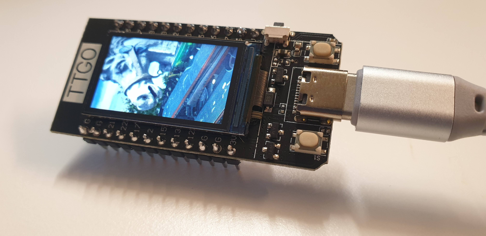

# 🤖📸 ESP32 OpenAI Image Display Project

This project is based on [Bodmer's PNG Test Project](https://github.com/Bodmer/PNG_TEST_ONLY/tree/master/png_test_url_spiffs_2x) and extends it to integrate with the OpenAI API. The ESP32 🦾 fetches an image 🖼️ generated by OpenAI's DALL-E model, saves it to the SPIFFS filesystem, and then displays it on a connected TFT screen 📺 using the TFT_eSPI library. This README outlines how the project works, required hardware 🛠️, software setup, and how to run it 🚀.

## 📝 Project Overview

### ✨ Features
- **🖼️ PNG Image Display**: Fetches a PNG image from a given URL 🌐 and displays it on the ESP32-driven TFT display.
- **🤖 OpenAI Integration**: Uses the OpenAI API to generate an image based on a text prompt ✍️, downloads it, and displays it on the TFT.
- **💾 SPIFFS Storage**: Stores downloaded images on SPIFFS for persistent access.

### 📊 Flowchart: System Workflow

1. **Start**: ESP32 boots up and connects to WiFi 📶.
2. **Image Generation**: The OpenAI API is called to generate a unique image ✨.
3. **Download Image**: The generated image is downloaded to SPIFFS 📂.
4. **Display Image**: The downloaded image is read from SPIFFS, resized, and displayed on the TFT 📺.
5. **Loop**: The system stays idle, and the image is displayed until reboot 🔄.

## 🚀 Getting Started

### 🔧 Hardware Requirements
- **ESP32 Board**: Any ESP32 board with enough RAM (>40 KB) for processing images.
- **TFT Display**: Compatible with TFT_eSPI library.
- **USB Cable**: For power 🔌 and data transfer.

### 💻 Software Requirements
- **Arduino IDE**: Version 1.8.9 or above.
- **Arduino Libraries**:
  - TFT_eSPI 📺
  - SPIFFS 💾
  - HTTPClient 🌐
  - WiFi 📶
  - WiFiClientSecure 🔒
  - ArduinoJson 📝

### ⚙️ Setup Instructions
1. **Install Libraries**: Use the Arduino Library Manager to install all required libraries 📚.
2. **Clone This Project**: Clone or download this repository and place it in your Arduino directory.
3. **Set Partition Scheme**: Select a partition scheme in the Arduino IDE (e.g., "16MB (2MB app, 12.5MB FATFS)") to allow enough space for SPIFFS.
4. **Upload Sketch to SPIFFS**: Use the Arduino IDE's data upload tool to load initial images or other necessary files to SPIFFS.
5. **Edit Credentials**: Update the `WIFI_SSID`, `WIFI_PASS`, and `OPENAI_API_KEY` in the code 🔑.

### ▶️ Running the Code
1. **Upload** the sketch to your ESP32 board using the Arduino IDE 💻.
2. Upon **startup**, the ESP32 will connect to WiFi and generate an image using OpenAI's DALL-E API 🤖.
3. The image is then **downloaded** and **displayed** on the TFT screen 📺.

### 🖼️ Example Output

### ✏️ Customizing Image Generation
- The text prompt used for image generation can be changed in the `generateImage()` function ✨. By default, it uses "a pegasus" 🐎.
- The image size requested is set to "256x256" to optimize for RAM usage 📏.

## 🙏 Acknowledgements
This project is an adaptation of the [Bodmer's PNG Test Project](https://github.com/Bodmer/PNG_TEST_ONLY/tree/master/png_test_url_spiffs_2x) and integrates with OpenAI for dynamic image generation 🌟. The original project provides the base for downloading and displaying PNG images on an ESP32 using SPIFFS and the TFT_eSPI library.

## 📜 License
This project is licensed under the MIT License 📄. See the LICENSE file for details.
